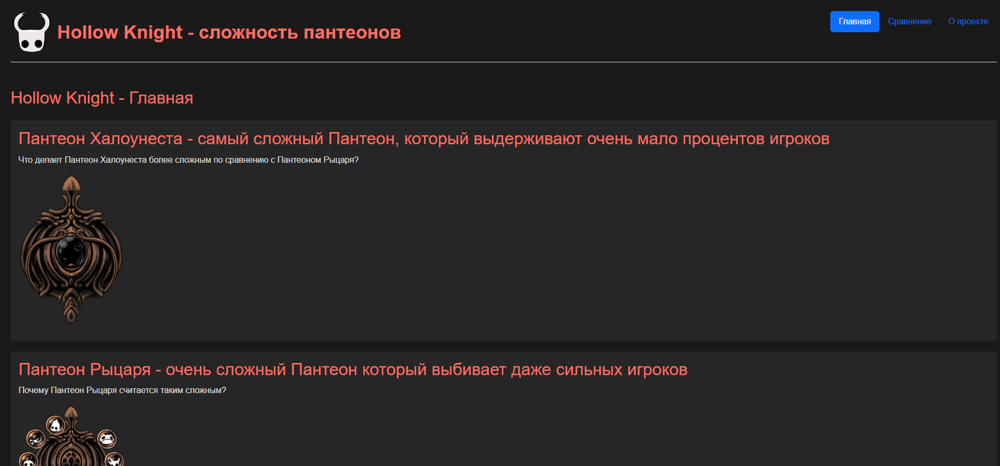
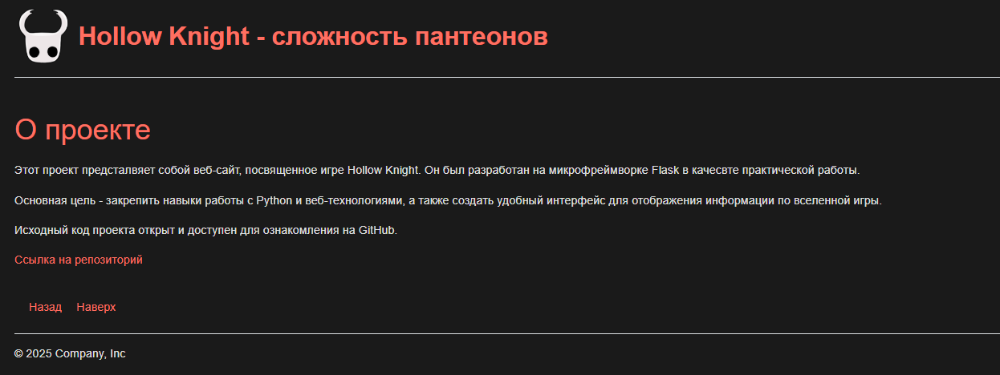
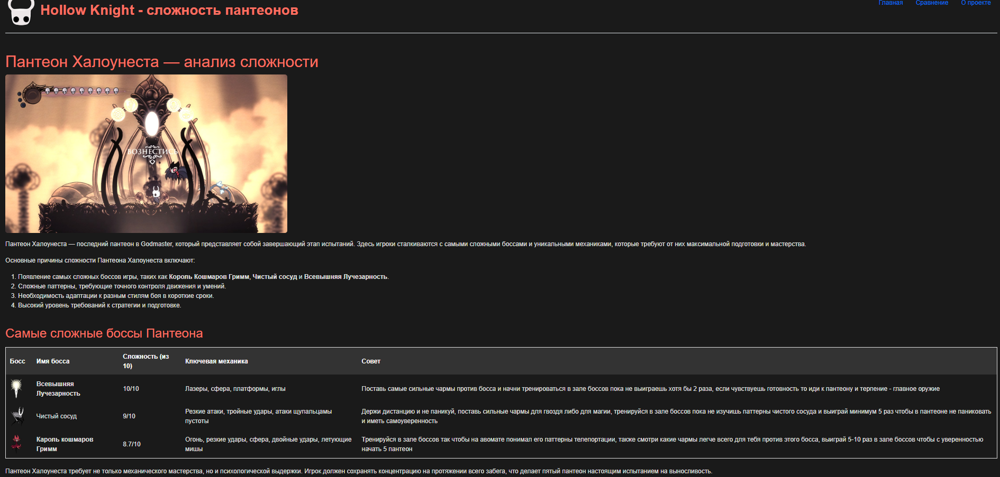

# 🪲 Hollow Knight - гайд пантеонов (Flask Web-site)

## 📝 Описание
Динамический вики-сайт на Flask, представляющий собой интерактивный гайд по Пантеонам и сложным боссам в игре Hollow Knight. Проект разработан с разделением логики на бэкенд (Python/Flask) и фронтенд (HTML/CSS) с использованием шаблонизатора Jinja2.

## 💻 функционал и особенности

* **Многостраничность:** Реализована серверная маршрутизация для вкладок "Главная", "Сравнение" и "О проекте".
* **Шаблонизация Jinja2:** Использование базового шаблона (`base.html`) и механизмов наследования блоков для исключения дублирования интерфейса (шапка, навигация, подвал).
* * **Информационные таблицы:** Структурированные таблицы с оценкой сложности боссов (из 10), разбором ключевых механик, тактическими советами и визуальными ассетами.
* **Изоляция конфигурации:** Все временные файлы сборщика, виртуальное окружение (`venv/`), системный мусор (`.DS_Store`) и конфигурационные файлы надёжно скрыты через `.gitignore`.
* **Изоляция конфигурации:** Все временные файлы сборщика, виртуальное окружение (`venv/`), системный мусор (`.DS_Store`) и конфигурационные файлы надёжно скрыты через `.gitignore`.
* **Компонентная верстка (Bootstrap):** Быстрое и отзывчивое построение интерфейса с использованием готовых компонентов фреймворка Bootstrap (навигационная панель, footer). Стили адаптированы под мрачную атмосферу игры с помощью кастомных CSS-модификаторов.

## 🧑🏻‍💻 Технологии

### Основной стек
- **Python 3.10+** - базовый язык разработки
- **Flask** - веб-фреймворк для реализации серверной логики и маршрутизации

### Интерфейс и верстка
* **Bootstrap** - фреймворк для быстрого построения адаптивной сетки и UI-компонентов
* **HTML5 / CSS3** - семантическая разметка и кастомные стили в темной теме игры
* **Jinja2** - шаблонизатор для динамического рендеринга и наследования страниц

## ⏬ Установка

1. Клонируйте репозиторий:

    ```bash
    git clone https://github.com/skrizzz-dev/hollow_knight_vlog.git
    ```

2. Создайте и активируйте виртуальное окружение
   
   **Windows:**
   ```bash
   python -m venv venv
   venv\Scripts\activate
   ```

   **Linux/Mac:**
   ```bash
   python -m venv venv
   source venv/bin/activate
   ```

3. Установите зависимости:
   ```bash
   pip install -r requirements.txt
   ```

4. Запустите приложение:
   ```bash
   flask run
   ```
   или
      ```bash
   python app.py
   ```


## 📂 Структура проекта

- `app.py` - основной файл приложения, запуск сервера и маршрутизация (роуты).
- `static/` - папка со статическими файлами сайта.
  - `css/` - кастомные таблицы стилей (дизайн, темная тема).
  - `image/` - визуальные ассеты, иконки и изображения боссов.
- `templates/` - HTML-шаблоны Jinja2 (базовый шаблон `base.html` и страницы вкладок).
- `.gitignore` - файл исключений для Git (скрывает venv, кэш и конфиги).
- `requirements.txt` - список внешних зависимостей проекта (Flask и др.).


## 📷 Скриншоты

### Главная страница


### О проекте



### Пример


